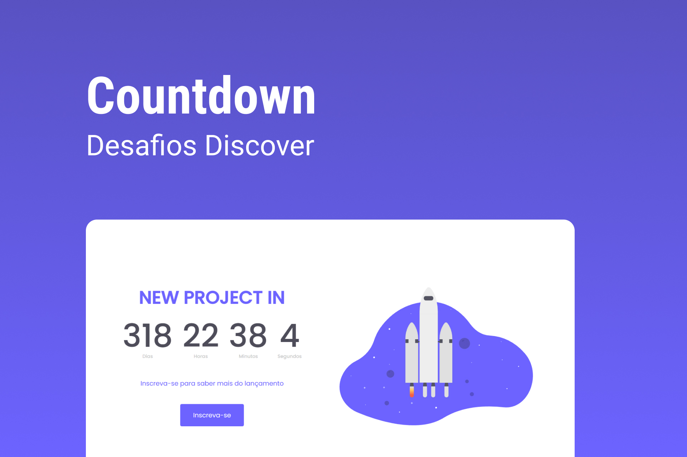

<h1 align="center"> Countdown </h1>

Desafio promovido pela RocketSeat, para a criação de um contador para uma certa data.  

  <a href="#-tecnologias">Tecnologias</a>&nbsp;&nbsp;&nbsp;|&nbsp;&nbsp;&nbsp;
  <a href="#-projeto">Projeto</a>
  

  

 

  

## 🚀 Tecnologias

Esse projeto foi desenvolvido com as seguintes tecnologias:

- HTML e CSS
- JavaScript
- Git e Github
- Figma

## 💻 Projeto

O projeto partiu de um desafio promovido pela RocketSeat afim da criação do SocialTree.

- [Acesse o projeto finalizado, online.](https://kauatiezzi.github.io/Countdown/)

---

Feito com ♥ by Kauã Tiezzi [Entre em contato comigo clicando aqui.](https://discord.gg/ARxrzArWsA)
